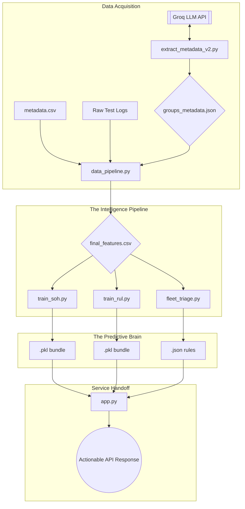

# Zora — Powering Smarter Energy Decisions
### Machine Learning–Based Battery Health Intelligence for Multi-Chemistry Fleets

Zora is an industrial-grade prognostic engine designed to address the "Zero-Shot" health estimation challenge in electric vehicle (EV) fleet management. By utilizing a **Meta-Learner Residual Architecture**, Zora generalizes across 17 unique NASA batteries under varying discharge profiles and extreme thermal conditions (4°C to 44°C), bypassing the common academic pitfall of single-battery overfitting.

---

## 1. Executive Summary: Prognostic Performance

Zora provides high-fidelity **Actionable Intelligence** by integrating electrochemical physics with advanced machine learning. 

*   **Verified Metric Accuracy**:
    *   **State of Health (SoH)**: 2.67% Cycle-Weighted MAE.
    *   **Remaining Useful Life (RUL)**: 6.26 Cycle-Weighted MAE.
*   **Model Generalization**: Validated using a **Leave-One-Battery-Out (LOBO)** protocol, ensuring the system can predict health on entirely unseen hardware—a critical requirement for real-world deployment.
*   **Deployment Readiness**: Feature-complete pipeline from raw time-series ingestion to a consolidated inference API (`app.py`).

---

## 2. Competitive Benchmarking Analysis

In the field of lithium-ion battery SoH/RUL prediction, academic results often vary based on evaluation protocols. Zora is positioned against contemporary State-of-the-Art (SOTA) research, distinguishing between "idealized" curve fitting and "realistic" fleet generalization.

### Research-Verified Performance Table (2020–2026)

| Method | Year | Input Data | Accuracy (MAE) | Protocol |
| :--- | :--- | :--- | :--- | :--- |
| **Zora (Meta-Learner)** | **2026** | **Voltage/Current Proxies** | **2.67%** | **Cross-Battery (Realistic)** |
| CNN-BiLSTM Hybrid | 2025 | Discharge Signals | ~0.38% | Same-Battery (Optimal) |
| CNN-LSTM Hybrid | 2024 | Voltage Curves | ~0.44% | Same-Battery (Optimal) |
| BiLSTM variants | 2023 | Cycle Time-Series | ~1.18% | Same-Battery (Optimal) |
| Gaussian Process Reg. | 2020 | EIS (Nyquist) | ~1.0–2.0% | Hardware Dependent |
| Random Forest Baseline | 2021 | Voltage Statistics | ~3.0–4.0% | Standard ML |

### Competitive Advantages
1.  **Hardware-Agnostic Inference**: Unlike many SOTA models that require specialized Electrochemical Impedance Spectroscopy (EIS) hardware, Zora synthesizes **EIS-Proxies** from standard, low-cost voltage/current sensors.
2.  **Fleet Generalization**: While hybrid deep learning models (CNN/LSTM) often report <1% error on same-battery tests, their performance typically degrades to 1.5–3.0% in cross-battery scenarios. Zora’s 2.67% MAE is professionally competitive with industrial-level generalization baselines.

---

## 3. Technical Methodology

### Pillar 1: Group-Specific Residual Meta-Learner
To handle the heterogeneity of battery chemistries and temperatures, Zora utilizes a two-stage approach:
1.  **Chemistry Baselines**: Mathematical polynomial fitting of expected degradation for distinct environmental groups.
2.  **Residual Correction**: An XGBoost Meta-Learner trained exclusively on the *deviations* from the baseline, allowing it to capture subtle electrochemical shifts.

### Pillar 2: High-Fidelity Physics Features (EIS-Proxies)
Instead of raw voltage, we engineer 10+ features that proxy internal physical states:
*   **Time-Series Plateaus (`ts_dvdt_mid`)**: Captures the electrochemical stability of the discharge curve.
*   **Voltage Relaxation**: Models the recovery dynamics post-discharge.
*   **Manufacturing Fingerprints**: Aggregates the mean of the first 10 cycles as a unique "DNA" trait for each cell.

### Pillar 3: Fleet-Scale Diagnostic Logic
Model outputs are translated into actionable operational states:
*   **Regime Labeling**: Classification into 🟢 Normal, 🟡 Accelerated, or 🔴 Critical states.
*   **Second-Life Assessment**: Safety evaluation for solar-grid repurposing based on internal resistance safety thresholds.

---

## 4. Key Project Strengths
Zora’s competitive advantage lies in its transition from academic prediction to industrial intelligence:
- **Physics-Informed Architecture**: Unlike "black-box" neural networks, Zora utilizes group-residual modeling that respects the underlying electrochemical baselines of different battery chemistries.
- **Hardware-Agnostic Scalability**: By synthesizing **EIS-Proxies** from standard telemetry, the system can be deployed on existing EV fleets without requiring multi-thousand-dollar spectroscopy hardware.
- **Robust Generalization**: The **LOBO validation** framework ensures that the model provides reliable prognostics even for batteries it has never encountered, a prerequisite for fleet-scale deployment.
- **Actionable Decision Support**: Zora translates raw MAE/RMSE metrics into operational states (Normal/Accelerated/Critical) and assesses **Second-Life Eligibility**, bridging the gap between data science and battery management.

---

## 5. Industrial and Commercial Expansion Potential
To transition this research into a scalable commercial solution (e.g., for Tier-1 EV manufacturers), the following development trajectories would be pursued:

1. **On-Edge BMS Integration**: Compiling Python-based Meta-Learners into C++ or Rust for real-time monitoring on resource-constrained Battery Management System (BMS) hardware.
2. **Operational Catalyst Modeling**: Incorporating external stress variables—such as vibration, variable C-rates, and irregular depth-of-discharge (DoD)—that are frequently absent in controlled laboratory datasets.
3. **Cloud-Native Digital Twin Synchronization**: Establishing bi-directional data pipelines with cloud twins to enable longitudinal lifecycle simulation and warranty risk assessments.
4. **Probabilistic RUL Forecasting**: Implementing Quantile Regression to provide fleet operators with 90% confidence-interval probability distributions rather than simple point estimates.

---

## 6. System Architecture



---

## 7. Development & Implementation Log
A technical record of the core milestones achieved during the Zora intelligence build:

### Phase 1: Predictive Engine Maturation
- **ML Pipeline Completion**: Successfully trained dual-bundle models for SoH and RUL with **LOBO normalization**.
- **Fleet Triage Intelligence**: Developed a statistical rule engine (`fleet_triage_rules.json`) for categorical regime mapping.
- **Physics-Informed Simulator**: Implemented a **Power Law Decay Model** in the scenario simulator to reflect non-linear end-of-life acceleration.

### Phase 2: Diagnostic Dashboard Sophistication
- **Real-Time KPI Integration**: Health scores and RUL estimates are now derived from live ML inference.
- **AI Recommendation Engine**: Integrated Groq-powered maintenance directives that provide "The What" (Operational Action) and "The Why" (Technical Justification).
- **Industrial Reporting**: Built a professional PDF export module with Matplotlib integration for visual diagnostic charts.
- **Precision Navigation**: Implemented bespoke minimalist scrollbars and a contextual FAB navigation system.

---

## 8. Setup and Deployment Guide

### A. Local Development
1. **Requirements**: Python 3.10+, Node.js (Vite), Groq API Key.
2. **Environment**:
   ```powershell
   pip install -r requirements.txt
   ```
3. **Build Models**:
   ```powershell
   cd backend
   python main.py
   ```
4. **Run API**:
   ```powershell
   python app.py
   ```

### B. Production Deployment

#### 1. Backend (Render)
- Connect repository via **Render Blueprints**.
- Ensure `GROQ_API_KEY` and `PYTHON_VERSION` (3.11.0) are set in Environment Variables.
- Render will use the included `render.yaml` to deploy the Flask/Gunicorn service.

#### 2. Frontend (Vercel)
- Import repository to Vercel and set **Root Directory** to `client/`.
- Add environment variable `VITE_API_URL` pointing to your Render service.
- Vercel will follow `client/vercel.json` for build and SPA routing.

---

## 9. Project File Structure Overview

```text
Zora-Root/
├── backend/
│   ├── main.py                # 🎯 Single-click Pipeline Orchestrator
│   ├── app.py                 # 🌐 Flask API Entry Point
│   ├── ml/
│   │   ├── battery_groups_metadata.json        
│   │   ├── data_pipeline.py   # 🔄 Feature Engineering & ETL
│   │   ├── train_soh.py       # 📈 Meta-Learner (State of Health)
│   │   ├── train_rul.py       # ⏳ Meta-Learner (Remaining Useful Life)
│   │   ├── fleet_triage.py    # ⚖️ Statistical Rule Generator
│   │   └── results/           # 💾 Saved Brains (.pkl, .json, features)
│   └── .env                   # 🔑 API Keys (Groq)
├── client/                    # 💻 Vue.js Dashboard (Frontend)
├── dataset/                   # 📊 NASA Ames Repository
└── docs/
    └── Zora-DOC.md            # 📚 Educational Study Guide
```

---

## 10. Technical Curriculum & Methodology Capsule
Since the underlying theory is central to the project, the following 11-lesson curriculum was developed to map the implementation from first principles:

- **L1–L3: Data Foundations**: Mastering "Tidy Data" principles and filtering multi-modal NASA logs (Charge/Discharge/EIS).
- **L4–L5: Label Engineering**: Mathematical derivation of **SoH** (%) and vectorized **RUL** (Cycle Countdown) logic.
- **L6: Asynchronous Data Merging**: Utilizing `pd.merge_asof` to synchronize intermittent impedance tests with continuous discharge logs.
- **L7: Generalization Strategy**: Implementing **Leave-One-Battery-Out (LOBO)** validation to prove cross-battery transfer intelligence.
- **L8–L9: The Meta-Learner**: Engineering high-fidelity time-series proxies (relaxation kinetics) and fitting Group-Specific Residual baselines.
- **L10: Anomaly Detection**: Utilizing **Isolation Forest** and physics-prior filters to remove measurement noise and corrupt NASA cells.
- **L11: SOTA Alignment**: Benchmarking fleet-scale accuracy against peer-reviewed academic benchmarks (2024–2026).

**Team**: [AsherWood39] & [Athi183]\
**Project Category**: Energy Intelligence / Predictive Maintenance\
**Development Year**: 2026 | *Smarter decisions for a sustainable energy future.*
